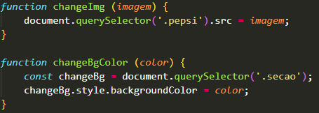

# :triangular_ruler: Landing Page Pepsi Responsive
* Landing Page demonstração da lata de refrigerante Pepsi.

# :memo: Índice
* [Proposta]()
* [Desafio]()
* [Tecnologias]()
* [Objetivo]()
* [Aprendizado]()
* [Imagens do Projeto]()
* [Links]()
* [Autor]()

# :chart_with_upwards_trend: Proposta
* A proposta desse projeto foi trabalhar a interatividade em JavaScript e desempenhar um layout bastante estiloso e agradável ao usuário.

# :trophy: Desafio
* Meu maior desafio nesse projeto foi aplicar todo o meu conhecimento em JavaScript.

# :hammer_and_wrench: Tecnologias
* JavaScript
* HTML
* CSS

# :dart: Objetivo
* Aplicar responsividade para todos os tamanhos de dispositivos móveis.

# :open_book: Aprendizado
* Nesse pedaço de código pequeno, não menos importante por ser pequeno, mas que deu uma entrega bem legal no projeto alterando a imagem, e o background-color da página.

# :camera: Imagens do Projeto
* Gif Apresentação do Projeto

* Imagem do Projeto - Background Preto

* Imagem do Projeto - Background Vermelho

* Imagem do Projeto - Background Azul

# :link: Link Deploy
Deploy - https://incandescent-croissant-deddf8.netlify.app/

# :technologist: Autor
GitHub - https://github.com/rodrigobarros2802

LinkedIn - https://www.linkedin.com/in/rodrigobarros2802/
