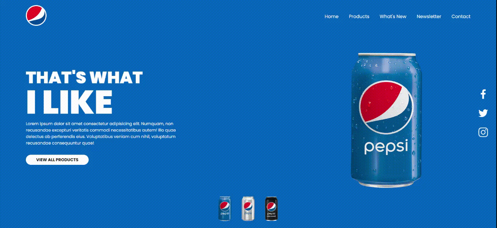
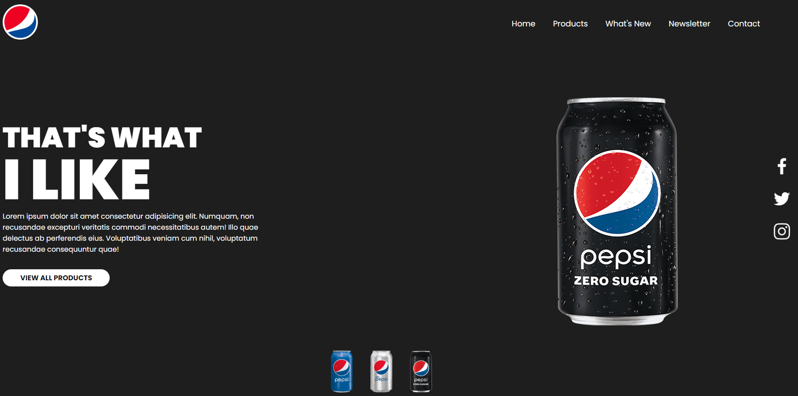
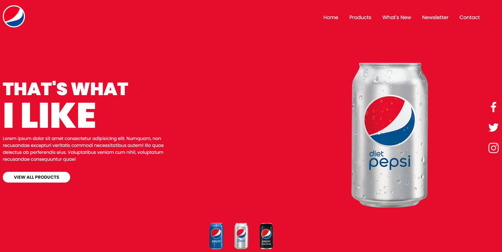
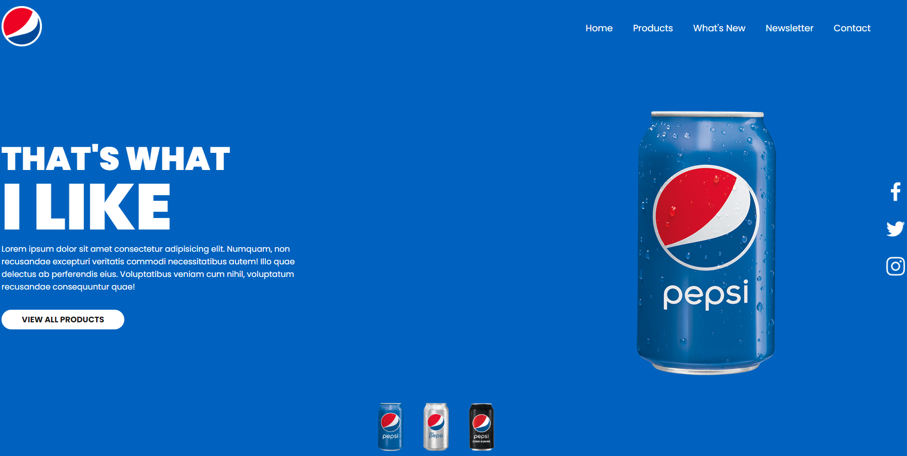

# :triangular_ruler: Landing Page Pepsi Responsive

# :memo: Índice

# :chart_with_upwards_trend: Proposta

# :trophy: Desafio

# :hammer_and_wrench: Tecnologias

# :dart: Objetivo

# :open_book: Aprendizado

# :camera: Imagens do Projeto
* Gif Apresentação do Projeto

* Imagens do Projeto

# :link: Links
Deploy - https://incandescent-croissant-deddf8.netlify.app/

# :technologist: Autor
GitHub - https://github.com/rodrigobarros2802

LinkedIn - https://www.linkedin.com/in/rodrigobarros2802/
